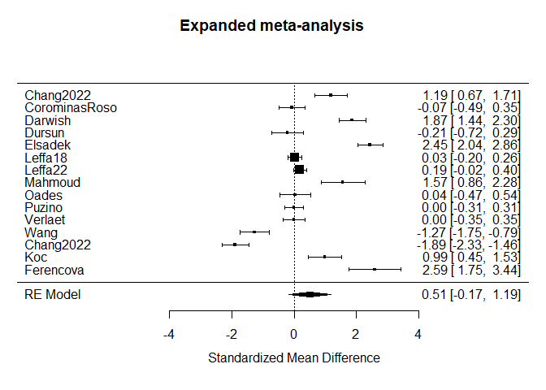
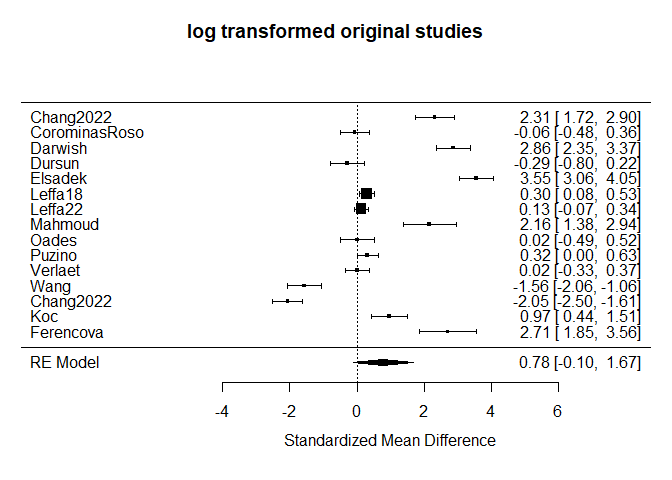
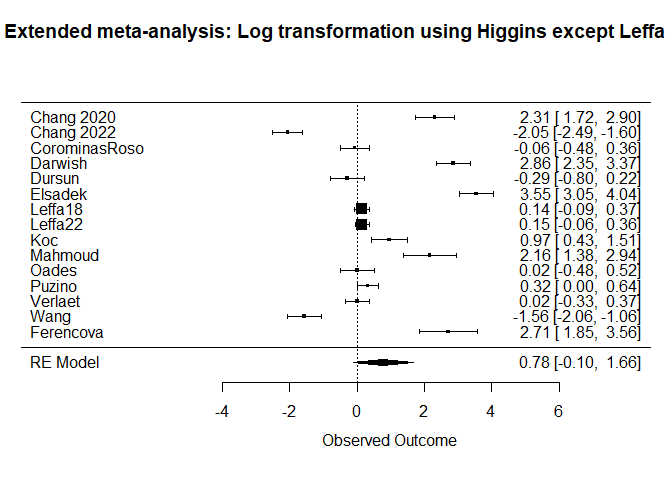
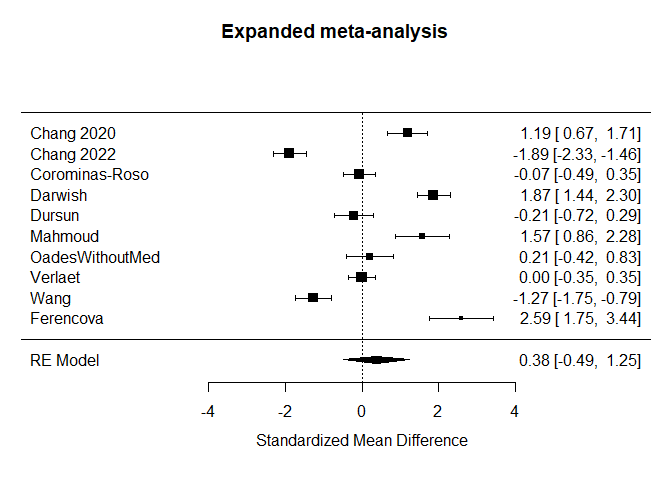
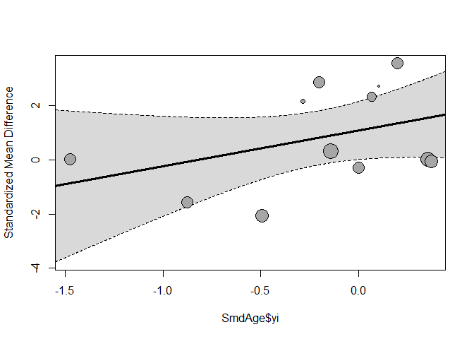
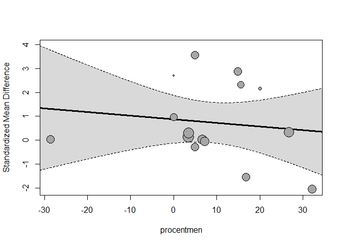
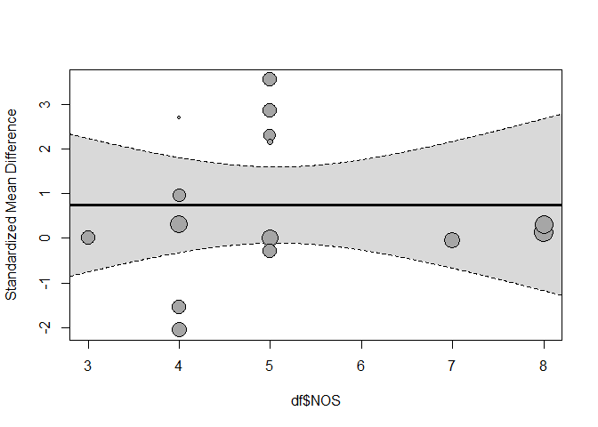

Setup knitr, install required packages.

rma.mv för meta-analyses, raw values, (rma.mv då leffa är samma
patienter + control vid två olika tidpunkter)

    df <- read.csv(here("data", "studier.csv"))
    df <- escalc(
                        measure = "SMD",
                        data=df,
                        m1i = meanIL6_adhd,
                        sd1i = sdIL6_adhd,
                        n1i = n_adhd,
                        m2i = meanIL6_control,
                        sd2i = sdIL6_control,
                        n2i = n_control,
                        append = TRUE
                        )

     
    result <- rma.mv(yi, vi, random = ~ 1 | StudyNumber/Group, data = df)
    forest(result, slab = df$Studies, main = "Expanded meta-analysis")

    result

    ## 
    ## Multivariate Meta-Analysis Model (k = 15; method: REML)
    ## 
    ## Variance Components:
    ## 
    ##             estim    sqrt  nlvls  fixed             factor 
    ## sigma^2.1  1.6379  1.2798     14     no        StudyNumber 
    ## sigma^2.2  0.0002  0.0127     15     no  StudyNumber/Group 
    ## 
    ## Test for Heterogeneity:
    ## Q(df = 14) = 376.1952, p-val < .0001
    ## 
    ## Model Results:
    ## 
    ## estimate      se    zval    pval    ci.lb   ci.ub    
    ##   0.5116  0.3486  1.4675  0.1422  -0.1717  1.1949    
    ## 
    ## ---
    ## Signif. codes:  0 '***' 0.001 '**' 0.01 '*' 0.05 '.' 0.1 ' ' 1

Higgins method 1 för att transformera värden till log-värden då IL-6
inte är normalfördelade

    higgins_1_mean <- function(mean, sd) {
      return(log(mean) - 0.5 * log((sd^2/mean^2) + 1))
    }

    higgins_1_sd <- function(mean, sd) {
      return(sqrt(log(sd^2/mean^2 + 1)))
    }

Meta-analysis of skewed data: Combining results reported on
log-transformed or raw scales (nih.gov)

    df <- read.csv(here("data", "studier.csv"))

    df$logtransformmean_adhd <- higgins_1_mean(df$meanIL6_adhd, df$sdIL6_adhd)
    df$logtransformSD_adhd <- higgins_1_sd(df$meanIL6_adhd, df$sdIL6_adhd)
    df$logtransformmean_control <- higgins_1_mean(df$meanIL6_control, df$sdIL6_control)
    df$logtransformSD_control <- higgins_1_sd(df$meanIL6_control, df$sdIL6_control)

    df <- escalc(
                  measure = "SMD",
                    m1i = logtransformmean_adhd,
                    sd1i = logtransformSD_adhd,
                    n1i = n_adhd,
                    m2i = logtransformmean_control,
                    sd2i = logtransformSD_control,
                    n2i = n_control,
                    data = df,
                    append = TRUE
                  )
     
    logresult <- rma.mv(yi, vi, random = ~ 1 | StudyNumber/Group, data = df)
    forest(logresult, slab = df$Studies, main = "log transformed original studies")

Kombinationsmetod: Higgins metod 1 och extraherade loggade värden från
Leffa som redovisade loggade värden. Datan i filen ‘logexpand’ kommer
från forest plotten i den tidigare koden som använder metod 1 från
Higgins. Däremot är datan i Leffa manuellt inskriven i ‘logexpand’, så
alla rader förutom Leffa18 och Leffa22 ska ha samma estimat i
forest-plotten.

    logexpand <- read.csv(here("data", "logexpand.csv"))
    logexpand$se <- (logexpand$upper - logexpand$lower) / (qnorm(0.975)*2) # CI --> SE
    logexpand$V <- logexpand$se^2
    resultlogexpand <- rma.mv(V = V, yi = logexpand$hedgesg, random = ~ 1 | StudyNumber/Group, data = logexpand)
    forest(resultlogexpand, slab = logexpand$AStudies, main = "Extended meta-analysis: Log transformation using Higgins except Leffa")

Poolad subgrupps analys av de studier där ADHD personerna var
omedicinerade, kodmässigt en “vanlig meta-analys”

    df <- read.csv(here("data", "unmedicated.csv"))
    df <- escalc(
                          measure = "SMD", 
                          m1i = meanIL6_adhd, 
                          sd1i = sdIL6_adhd, 
                          n1i = n_adhd, 
                          m2i = meanIL6_control, 
                          sd2i = sdIL6_control, 
                          n2i = n_control,
                          data = df,
                          append = T
                          )

    result <- rma(yi, vi, data = df)
    forest(result, slab = df$Studies, main = "Expanded meta-analysis")

    result

    ## 
    ## Random-Effects Model (k = 10; tau^2 estimator: REML)
    ## 
    ## tau^2 (estimated amount of total heterogeneity): 1.8737 (SE = 0.9198)
    ## tau (square root of estimated tau^2 value):      1.3688
    ## I^2 (total heterogeneity / total variability):   96.76%
    ## H^2 (total variability / sampling variability):  30.90
    ## 
    ## Test for Heterogeneity:
    ## Q(df = 9) = 248.4313, p-val < .0001
    ## 
    ## Model Results:
    ## 
    ## estimate      se    zval    pval    ci.lb   ci.ub    
    ##   0.3797  0.4418  0.8596  0.3900  -0.4861  1.2456    
    ## 
    ## ---
    ## Signif. codes:  0 '***' 0.001 '**' 0.01 '*' 0.05 '.' 0.1 ' ' 1

Nu kommer lite meta-regressioner, är lite osäker på den här koden Age
meta-regression

    df <- read.csv(here("data", "studier.csv"))

    df$logtransformmean_adhd <- higgins_1_mean(df$meanIL6_adhd, df$sdIL6_adhd)
    df$logtransformSD_adhd <- higgins_1_sd(df$meanIL6_adhd, df$sdIL6_adhd)
    df$logtransformmean_control <- higgins_1_mean(df$meanIL6_control, df$sdIL6_control)
    df$logtransformSD_control <- higgins_1_sd(df$meanIL6_control, df$sdIL6_control)

    df <- escalc(measure = "SMD",
                    m1i = logtransformmean_adhd,
                    sd1i = logtransformSD_adhd,
                    n1i = n_adhd,
                    m2i = logtransformmean_control,
                    sd2i = logtransformSD_control,
                    n2i = n_control,
                    data = df
                    )

    SmdAge <- escalc(
                  measure="SMD", 
                  m1i=Age_ADHD_mean, 
                  m2i=AgeHealthymean,
                    sd1i=Age_ADHD_SD, 
                  sd2i=Age_Healthy_SD,
                    n1i=n_adhd, 
                  n2i=n_control,
                    data=df
                  )
     
    regression <- rma(
                    yi, 
                    vi,
                    mods = ~ SmdAge$yi, 
                    SmdAge$vi, # Formula might be wrong, please double check. This argument does nothing.
                    data=df,
                    method="REML")

    ## Warning: 3 studies with NAs omitted from model fitting.

    summary(regression)

    ## 
    ## Mixed-Effects Model (k = 12; tau^2 estimator: REML)
    ## 
    ##   logLik  deviance       AIC       BIC      AICc   
    ## -19.8633   39.7266   45.7266   46.6343   49.7266   
    ## 
    ## tau^2 (estimated amount of residual heterogeneity):     3.0367 (SE = 1.3927)
    ## tau (square root of estimated tau^2 value):             1.7426
    ## I^2 (residual heterogeneity / unaccounted variability): 98.09%
    ## H^2 (unaccounted variability / sampling variability):   52.44
    ## R^2 (amount of heterogeneity accounted for):            6.64%
    ## 
    ## Test for Residual Heterogeneity:
    ## QE(df = 10) = 471.6072, p-val < .0001
    ## 
    ## Test of Moderators (coefficient 2):
    ## QM(df = 1) = 1.7823, p-val = 0.1819
    ## 
    ## Model Results:
    ## 
    ##            estimate      se    zval    pval    ci.lb   ci.ub    
    ## intrcpt      1.0798  0.5456  1.9791  0.0478   0.0105  2.1491  * 
    ## SmdAge$yi    1.3193  0.9882  1.3350  0.1819  -0.6176  3.2562    
    ## 
    ## ---
    ## Signif. codes:  0 '***' 0.001 '**' 0.01 '*' 0.05 '.' 0.1 ' ' 1

    regplot(regression)

sex meta-regression

    procentmen <- df$ADHDprocentmales - df$Healthyprocentmales
    regression <- rma(
                    yi, 
                    vi,
                    mods = ~ procentmen,
                    data=df, method="REML")
     
    summary(regression)

    ## 
    ## Mixed-Effects Model (k = 15; tau^2 estimator: REML)
    ## 
    ##   logLik  deviance       AIC       BIC      AICc   
    ## -25.1709   50.3418   56.3418   58.0367   59.0085   
    ## 
    ## tau^2 (estimated amount of residual heterogeneity):     2.7339 (SE = 1.0988)
    ## tau (square root of estimated tau^2 value):             1.6534
    ## I^2 (residual heterogeneity / unaccounted variability): 98.50%
    ## H^2 (unaccounted variability / sampling variability):   66.87
    ## R^2 (amount of heterogeneity accounted for):            0.00%
    ## 
    ## Test for Residual Heterogeneity:
    ## QE(df = 13) = 525.3182, p-val < .0001
    ## 
    ## Test of Moderators (coefficient 2):
    ## QM(df = 1) = 0.2285, p-val = 0.6326
    ## 
    ## Model Results:
    ## 
    ##             estimate      se     zval    pval    ci.lb   ci.ub    
    ## intrcpt       0.8765  0.5109   1.7155  0.0863  -0.1249  1.8778  . 
    ## procentmen   -0.0152  0.0317  -0.4781  0.6326  -0.0773  0.0470    
    ## 
    ## ---
    ## Signif. codes:  0 '***' 0.001 '**' 0.01 '*' 0.05 '.' 0.1 ' ' 1

    regplot(regression)

Nos-score metaregression

    regression <- rma(
                    yi, 
                    vi,
                    mods = ~ df$NOS,
                    data=df, method="REML")
     
    summary(regression)

    ## 
    ## Mixed-Effects Model (k = 15; tau^2 estimator: REML)
    ## 
    ##   logLik  deviance       AIC       BIC      AICc   
    ## -25.2892   50.5785   56.5785   58.2733   59.2451   
    ## 
    ## tau^2 (estimated amount of residual heterogeneity):     2.7864 (SE = 1.1202)
    ## tau (square root of estimated tau^2 value):             1.6692
    ## I^2 (residual heterogeneity / unaccounted variability): 98.41%
    ## H^2 (unaccounted variability / sampling variability):   62.80
    ## R^2 (amount of heterogeneity accounted for):            0.00%
    ## 
    ## Test for Residual Heterogeneity:
    ## QE(df = 13) = 537.6957, p-val < .0001
    ## 
    ## Test of Moderators (coefficient 2):
    ## QM(df = 1) = 0.0001, p-val = 0.9941
    ## 
    ## Model Results:
    ## 
    ##          estimate      se    zval    pval    ci.lb   ci.ub    
    ## intrcpt    0.7350  1.5945  0.4610  0.6448  -2.3901  3.8601    
    ## df$NOS     0.0022  0.3021  0.0074  0.9941  -0.5898  0.5943    
    ## 
    ## ---
    ## Signif. codes:  0 '***' 0.001 '**' 0.01 '*' 0.05 '.' 0.1 ' ' 1

    regplot(regression)

